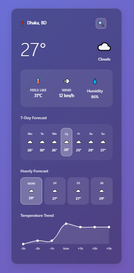

# 🌦️ React Weather App

একটি আধুনিক, রেসপন্সিভ এবং ব্যবহারকারী-বান্ধব ওয়েদার ফোরকাস্টিং অ্যাপ্লিকেশন, যা React ব্যবহার করে তৈরি করা হয়েছে। এই অ্যাপটি ব্যবহারকারীর বর্তমান অবস্থান অথবা সার্চ করা যেকোনো শহরের রিয়েল-টাইম আবহাওয়ার তথ্য প্রদর্শন করে।

**লাইভ ডেমো:** [https://weather-app-react-rana-01.vercel.app/](https://weather-app-react-rana-01.vercel.app/ )

 <!-- আপনি এখানে আপনার অ্যাপের একটি নতুন এবং সুন্দর স্ক্রিনশট যোগ করতে পারেন -->

---

## 🌟 ফিচারসমূহ (Features)

*   **📍 স্বয়ংক্রিয় অবস্থান নির্ণয়:** অ্যাপটি চালু হওয়ার সাথে সাথে ব্রাউজারের Geolocation API ব্যবহার করে ব্যবহারকারীর বর্তমান অবস্থান খুঁজে বের করে।
*   ** IP-ভিত্তিক ফলব্যাক:** যদি Geolocation API ব্যর্থ হয় বা ব্যবহারকারী অনুমতি না দেয়, তাহলে অ্যাপটি IP অ্যাড্রেস ব্যবহার করে আনুমানিক অবস্থান নির্ণয় করে।
*   **🔍 শহর সার্চ:** ব্যবহারকারী যেকোনো শহরের নাম লিখে সার্চ করতে পারেন এবং সেই শহরের আবহাওয়ার তথ্য দেখতে পারেন।
*   **☀️ বর্তমান আবহাওয়া:** তাপমাত্রা, আবহাওয়ার অবস্থা (যেমন, মেঘলা, রোদ), এবং "Feels Like" তাপমাত্রা প্রদর্শন করে।
*   **💨 বিস্তারিত তথ্য:** বাতাসের গতি এবং আর্দ্রতার মতো বিস্তারিত তথ্য দেখানো হয়।
*   **📅 কাল্পনিক ফোরকাস্ট:** ৭-দিন এবং পরবর্তী কয়েক ঘণ্টার জন্য একটি কাল্পনিক আবহাওয়ার পূর্বাভাস দেখানো হয় (ফ্রি API-এর সীমাবদ্ধতার কারণে)।
*   **⭐ ফেভারিট লিস্ট:** ব্যবহারকারীরা তাদের পছন্দের শহরগুলো ফেভারিট হিসেবে সংরক্ষণ করতে পারেন।
*   **📱 সম্পূর্ণ রেসপন্সিভ:** মোবাইল, ট্যাবলেট এবং ডেস্কটপ—সব ধরনের ডিভাইসের জন্য ডিজাইনটি সুন্দরভাবে কাজ করে।
*   **💪 শক্তিশালী এরর হ্যান্ডলিং:** নেটওয়ার্ক বা API সংক্রান্ত যেকোনো সমস্যা সুন্দরভাবে পরিচালনা করে এবং ব্যবহারকারীকে অবহিত করে।

---

## 🛠️ ব্যবহৃত প্রযুক্তি (Technologies Used)

*   **ফ্রন্টএন্ড:**
    *   [React.js](https://reactjs.org/ ) - ইউজার ইন্টারফেস তৈরির জন্য।
    *   [Axios](https://axios-http.com/ ) - API অনুরোধ পাঠানোর জন্য।
    *   HTML5 & CSS3 - স্ট্রাকচার এবং স্টাইলিং-এর জন্য।
*   **API:**
    *   [OpenWeatherMap API](https://openweathermap.org/api ) - আবহাওয়ার ডেটা আনার জন্য।
    *   [ip-api.com](https://ip-api.com/ ) - IP-ভিত্তিক Geolocation-এর জন্য।
*   **হোস্টিং:**
    *   [Vercel](https://vercel.com/ ) - প্রোডাকশন বিল্ড হোস্ট করার জন্য।

---

## 🚀 শুরু করার নিয়ম (Getting Started)

এই প্রজেক্টটি আপনার লোকাল মেশিনে চালানোর জন্য নিচের ধাপগুলো অনুসরণ করুন।

### পূর্বশর্ত (Prerequisites)

*   [Node.js](https://nodejs.org/en/ ) (v14 বা তার নতুন সংস্করণ) ইনস্টল করা থাকতে হবে।
*   `npm` বা `yarn` প্যাকেজ ম্যানেজার।

### ইনস্টলেশন (Installation)

1.  **প্রজেক্টটি ক্লোন করুন:**
    ```bash
    git clone https://github.com/your-username/your-repo-name.git
    cd your-repo-name
    ```

2.  **প্রয়োজনীয় প্যাকেজ ইনস্টল করুন:**
    ```bash
    npm install
    ```
    অথবা যদি `yarn` ব্যবহার করেন:
    ```bash
    yarn install
    ```

3.  **এনভায়রনমেন্ট ভেরিয়েবল সেট করুন:**
    *   প্রজেক্টের রুট ফোল্ডারে `.env` নামে একটি নতুন ফাইল তৈরি করুন।
    *   OpenWeatherMap থেকে আপনার API কী সংগ্রহ করুন।
    *   `.env` ফাইলে নিচের ফরম্যাটে আপনার API কী যোগ করুন:
      ```
      REACT_APP_OPENWEATHER_API_KEY=আপনার_API_কী_এখানে_দিন
      ```
    *   **দ্রষ্টব্য:** কোডটিকে `process.env.REACT_APP_OPENWEATHER_API_KEY` ব্যবহার করার জন্য আপডেট করতে হবে। বর্তমানে কী-টি সরাসরি কোডে লেখা আছে।

### প্রজেক্ট চালান (Running the Project )

ডেভেলপমেন্ট সার্ভার চালু করার জন্য নিচের কমান্ডটি চালান:
```bash
npm start
```
অথবা
```bash
yarn start
```
এরপর আপনার ব্রাউজারে [http://localhost:3000](http://localhost:3000 ) ভিজিট করুন।

---

## 📜 লাইসেন্স (License)

এই প্রজেক্টটি **MIT License**-এর অধীনে লাইসেন্সপ্রাপ্ত। বিস্তারিত জানার জন্য `LICENSE` ফাইলটি দেখুন।

```text
MIT License

Copyright (c) 2025 [Rana Islam or Weather App]

Permission is hereby granted, free of charge, to any person obtaining a copy
of this software and associated documentation files (the "Software"), to deal
in the Software without restriction, including without limitation the rights
to use, copy, modify, merge, publish, distribute, sublicense, and/or sell
copies of the Software, and to permit persons to whom the Software is
furnished to do so, subject to the following conditions:

The above copyright notice and this permission notice shall be included in all
copies or substantial portions of the Software.

THE SOFTWARE IS PROVIDED "AS IS", WITHOUT WARRANTY OF ANY KIND, EXPRESS OR
IMPLIED, INCLUDING BUT NOT LIMITED TO THE WARRANTIES OF MERCHANTABILITY,
FITNESS FOR A PARTICULAR PURPOSE AND NONINFRINGEMENT. IN NO EVENT SHALL THE
AUTHORS OR COPYRIGHT HOLDERS BE LIABLE FOR ANY CLAIM, DAMAGES OR OTHER
LIABILITY, WHETHER IN AN ACTION OF CONTRACT, TORT OR OTHERWISE, ARISING FROM,
OUT OF OR IN CONNECTION WITH THE SOFTWARE OR THE USE OR OTHER DEALINGS IN THE
SOFTWARE.
```
---
